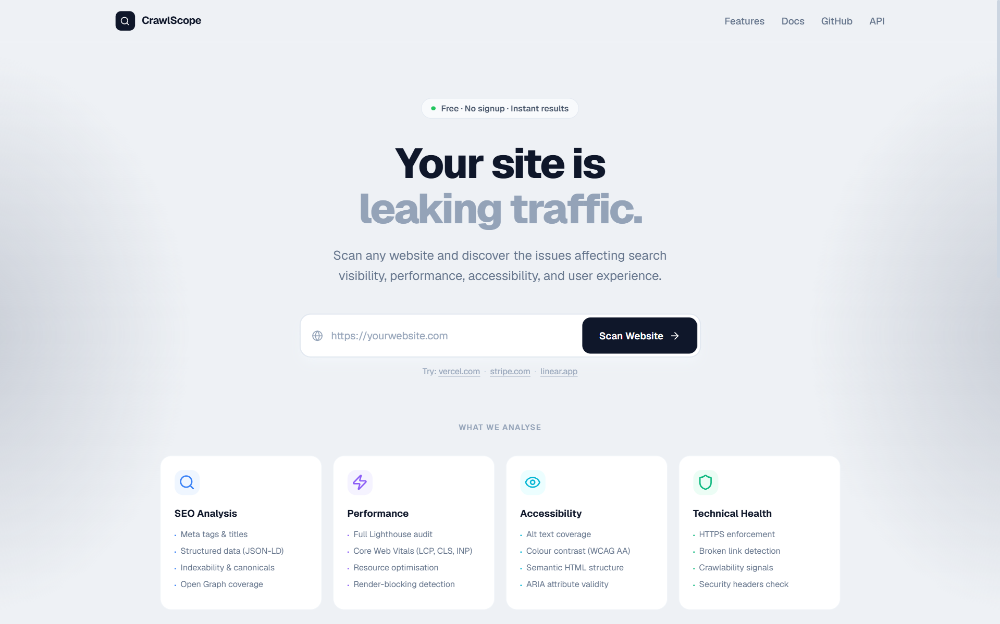

<div align="center">


# CrawlScope

**See it. Fix it. Ship it.**

Free, instant website auditing — SEO · Performance · Accessibility · Technical Health · Core Web Vitals

</br>

[](https://crawlscope.vercel.app)

</br>




</div>

---

## What is CrawlScope?

CrawlScope is a lightweight, opinionated website auditing tool. Enter a URL — get a prioritised, actionable audit report in under 30 seconds. No accounts, no database, no subscriptions, no saved history. Just scan and fix.

It runs a **real Lighthouse audit** inside a headless Chromium browser via Puppeteer, combines it with deep HTML analysis via Cheerio, and surfaces findings across 5 categories with severity-ranked fixes.

---

## Features

- **50+ checks** across SEO, Performance, Accessibility, Technical Health, and Content Structure
- **Real Lighthouse scores** — Performance, SEO, Accessibility, Best Practices
- **Core Web Vitals** — LCP, CLS, INP, TTFB, FCP with thresholds and recommendations
- **Priority Fixes** — every issue includes *why it matters*, *how to fix it*, and *expected impact*
- **Desktop & mobile screenshots** captured during the live scan
- **Page metadata** — title, H1, description, word count, technologies detected
- **Export** to Markdown, HTML, PDF (print), and JSON
- Zero auth · Zero database · Zero tracking

---

## Tech Stack

### Frontend

| Technology | Version | Purpose |
|---|---|---|
| [Next.js](https://nextjs.org) | `^15.0.0` | App Router, SSR, API Routes |
| [React](https://react.dev) | `^18.3.1` | UI framework |
| [TypeScript](https://typescriptlang.org) | `^5.5.4` | Type safety throughout |
| [Tailwind CSS](https://tailwindcss.com) | `^3.4.10` | Utility-first styling |
| [Framer Motion](https://www.framer.com/motion) | `^11.3.0` | Animations & transitions |
| [Lucide React](https://lucide.dev) | `^0.460.0` | Icon library |

### Backend / Scanning

| Technology | Version | Purpose |
|---|---|---|
| [Lighthouse](https://github.com/GoogleChrome/lighthouse) | `^12.2.0` | Performance, SEO, A11y, Best Practices scoring |
| [Puppeteer](https://pptr.dev) | `^25.1.0` | Headless Chromium — screenshots + page load |
| [Cheerio](https://cheerio.js.org) | `^1.0.0` | Fast HTML parsing for SEO & content checks |

### UI Primitives

| Technology | Purpose |
|---|---|
| [@radix-ui/react-tabs](https://www.radix-ui.com/primitives/docs/components/tabs) | Accessible tab components |
| [@radix-ui/react-progress](https://www.radix-ui.com/primitives/docs/components/progress) | Progress indicators |
| [@radix-ui/react-tooltip](https://www.radix-ui.com/primitives/docs/components/tooltip) | Tooltip primitives |
| [clsx](https://github.com/lukeed/clsx) + [tailwind-merge](https://github.com/dcastil/tailwind-merge) | Conditional class merging |

---

## Project Structure

```
crawlscope/
├── src/
│   ├── app/
│   │   ├── api/
│   │   │   └── scan/
│   │   │       └── route.ts          # POST /api/scan — runs Lighthouse + Puppeteer + Cheerio
│   │   ├── features/
│   │   │   └── page.tsx              # /features page
│   │   ├── docs/
│   │   │   └── page.tsx              # /docs page
│   │   ├── api-page/
│   │   │   └── page.tsx              # /api-page (API reference)
│   │   ├── privacy/
│   │   │   └── page.tsx              # /privacy page
│   │   ├── globals.css
│   │   ├── layout.tsx                # Root layout with Geist font
│   │   └── page.tsx                  # Landing page + scan orchestration
│   ├── components/
│   │   ├── shared/
│   │   │   ├── Nav.tsx               # Sticky nav with active link state
│   │   │   └── Footer.tsx            # Shared footer
│   │   ├── LandingPage.tsx           # Hero, URL input, feature cards, mock dashboard
│   │   ├── ScanLoader.tsx            # 12-step animated progress screen
│   │   ├── ResultsDashboard.tsx      # Full audit report with exports
│   │   ├── ScoreRing.tsx             # Animated SVG score ring
│   │   ├── VitalsSection.tsx         # Core Web Vitals cards
│   │   ├── AuditTabs.tsx             # SEO / Perf / A11y / Technical / Content tabs
│   │   ├── PriorityFixCard.tsx       # Expandable fix card with why/fix/impact
│   │   ├── CheckRow.tsx              # Pass / warn / fail check row
│   │   └── ScreenshotsSection.tsx    # Desktop / mobile screenshot toggle
│   ├── lib/
│   │   ├── scanner.ts                # Core scan engine (Puppeteer + Lighthouse + Cheerio)
│   │   └── utils.ts                  # cn(), scoreColor(), vitalStatusClasses(), etc.
│   └── types/
│       └── audit.ts                  # All TypeScript interfaces for AuditReport
├── public/
├── next.config.mjs
├── tailwind.config.ts
├── tsconfig.json
└── package.json
```

---

## Getting Started

### Prerequisites

- Node.js `18.x` or higher
- npm / yarn / pnpm

### Installation

```bash
# Clone the repo
git clone https://github.com/code2ahm/crawlscope.git
cd crawlscope

# Install dependencies
npm install

# Puppeteer downloads Chromium automatically on install (~170 MB)
# If it fails, run: npx puppeteer browsers install chrome
```

### Development

```bash
npm run dev
```

Open [http://localhost:3000](http://localhost:3000).

### Production Build

```bash
npm run build
npm run start
```

---

## How a Scan Works

```
User submits URL
      │
      ▼
POST /api/scan
      │
      ├── 1. Puppeteer launches headless Chromium
      │         • Navigates to URL (networkidle2)
      │         • Captures desktop screenshot (1280px)
      │         • Captures mobile screenshot (390px)
      │         • Measures load time + page size
      │
      ├── 2. Lighthouse runs on the open Chrome port
      │         • Performance score
      │         • SEO score
      │         • Accessibility score
      │         • Best Practices score
      │         • Core Web Vitals (LCP, CLS, TBT→INP, TTFB, FCP)
      │         • 20+ individual audits (render-blocking, WebP, etc.)
      │
      ├── 3. Cheerio parses the raw HTML
      │         • Title, meta description, H1–H6 structure
      │         • Canonical, OG tags, JSON-LD, lang attribute
      │         • Image alt text coverage
      │         • Internal link count
      │         • Form label coverage
      │         • Technology fingerprinting
      │
      └── 4. Results assembled into AuditReport
                • Overall score (weighted average)
                • Priority fixes ranked by severity
                • 50+ pass/warn/fail checks across 5 categories
                • Returned as JSON to the client
```

---

## API Reference

The scan endpoint is a standard Next.js Route Handler.

### `POST /api/scan`

**Request body**

```json
{
  "url": "https://example.com"
}
```

**Response — success**

```json
{
  "success": true,
  "report": {
    "url": "https://example.com",
    "domain": "example.com",
    "scannedAt": "2025-06-07T10:30:00.000Z",
    "scanDuration": 18420,
    "overall": 84,
    "lighthouse": {
      "performance": 71,
      "seo": 92,
      "accessibility": 68,
      "bestPractices": 87
    },
    "vitals": { "lcp": {...}, "cls": {...}, "inp": {...}, "ttfb": {...}, "fcp": {...} },
    "stats": { "critical": 2, "warnings": 4, "passed": 31, "total": 37 },
    "priorityFixes": [...],
    "seoChecks": [...],
    "performanceChecks": [...],
    "accessibilityChecks": [...],
    "technicalChecks": [...],
    "contentChecks": [...],
    "screenshots": { "desktop": "data:image/jpeg;base64,...", "mobile": "data:image/jpeg;base64,..." },
    "meta": {
      "title": "Example Domain",
      "description": "...",
      "h1": "Example Domain",
      "wordCount": 312,
      "loadTime": 1840,
      "pageSize": 48,
      "statusCode": 200,
      "technologies": ["Next.js", "Google Analytics"]
    }
  }
}
```

**Response — error**

```json
{
  "success": false,
  "error": "Invalid URL format"
}
```

**Status codes**

| Code | Meaning |
|---|---|
| `200` | Scan completed successfully |
| `400` | Missing or invalid URL |
| `500` | Scan failed (timeout, unreachable host, etc.) |

> **Note:** Scans typically take 15–45 seconds depending on page complexity and server speed. The route handler timeout is set to 120 seconds (`maxDuration = 120`).

---

## Export Formats

From the results dashboard, every report can be exported as:

| Format | Contents |
|---|---|
| **Markdown** | Full report — scores table, all checks by category, priority fixes, vitals |
| **HTML** | Standalone styled page, no dependencies, renders in any browser |
| **PDF** | Opens print dialog in a new tab, formatted for A4 via `@page` CSS |
| **JSON** | Raw `AuditReport` object, pretty-printed — useful for integrations |

---

## Deployment

### Vercel (recommended)

```bash
npm i -g vercel
vercel
```

Set the function timeout in `vercel.json` for the scan route:

```json
{
  "functions": {
    "src/app/api/scan/route.ts": {
      "maxDuration": 120
    }
  }
}
```

> **Important:** Puppeteer requires a Chromium binary. On Vercel, use [`@sparticuz/chromium`](https://github.com/Sparticuz/chromium) with [`puppeteer-core`](https://www.npmjs.com/package/puppeteer-core) instead of the full `puppeteer` package to stay within the serverless function size limit.

### Self-hosted / VPS

Works out of the box with standard `puppeteer` as long as the server has:
- Node.js 18+
- Chrome dependencies: `chromium-browser` or equivalent system packages

```bash
# Ubuntu / Debian — install Chrome dependencies
sudo apt-get install -y \
  libgbm-dev libnss3 libatk-bridge2.0-0 libdrm2 \
  libxcomposite1 libxdamage1 libxfixes3 libxrandr2 \
  libgbm1 libasound2

npm run build && npm start
```

### Docker

```dockerfile
FROM node:18-slim

# Install Chromium dependencies
RUN apt-get update && apt-get install -y \
  chromium libgbm-dev libnss3 libatk-bridge2.0-0 \
  libdrm2 libxcomposite1 libxdamage1 libxfixes3 \
  libxrandr2 libasound2 --no-install-recommends \
  && rm -rf /var/lib/apt/lists/*

ENV PUPPETEER_SKIP_CHROMIUM_DOWNLOAD=true
ENV PUPPETEER_EXECUTABLE_PATH=/usr/bin/chromium

WORKDIR /app
COPY package*.json ./
RUN npm ci --production
COPY . .
RUN npm run build

EXPOSE 3000
CMD ["npm", "start"]
```

---

## Environment Variables

No environment variables are required to run CrawlScope. All scanning happens server-side at request time.

Optional variables for future extension:

```bash
# .env.local (optional)
NEXT_PUBLIC_SITE_URL=https://crawlscope.vercel.app
```

---

## Audit Categories

| Category | Checks | Scoring weight |
|---|---|---|
| SEO | 12 checks — title, meta desc, H1, canonical, JSON-LD, OG tags, lang, robots, internal links, HTTPS | 30% |
| Performance | 11 checks — render-blocking, WebP, compression, caching, minification, unused JS/CSS | 30% |
| Accessibility | 12 checks — alt text, contrast, ARIA, button names, form labels, skip nav | 20% |
| Best Practices | Lighthouse native best-practices score | 20% |
| Technical | 9 checks — HTTPS, status code, viewport, deprecated HTML, vulnerable libraries | Info |
| Content | 6 checks — title/desc length, heading order, word count, internal linking | Info |

Overall score = `Performance × 0.3 + SEO × 0.3 + Accessibility × 0.2 + BestPractices × 0.2`

---

## Contributing

Pull requests are welcome. For major changes, open an issue first.

```bash
# Fork and clone
git clone https://github.com/your-username/crawlscope.git
cd crawlscope

# Create a feature branch
git checkout -b feat/your-feature

# Make changes, then
npm run lint
npm run build

# Push and open a PR
git push origin feat/your-feature
```

---

## Roadmap

- [ ] Vercel-compatible deployment with `@sparticuz/chromium`
- [ ] Batch URL scanning
- [ ] Shareable report URLs (short-lived, no database)
- [ ] CLI mode (`npx crawlscope https://example.com`)
- [ ] GitHub Action for CI auditing
- [ ] Score trend comparison (re-scan diff)

---

<div align="center">

Built with [Next.js](https://nextjs.org) · [Lighthouse](https://github.com/GoogleChrome/lighthouse) · [Puppeteer](https://pptr.dev) · [Tailwind CSS](https://tailwindcss.com)

**[crawlscope.vercel.app](https://crawlscope.vercel.app)**

</div>
